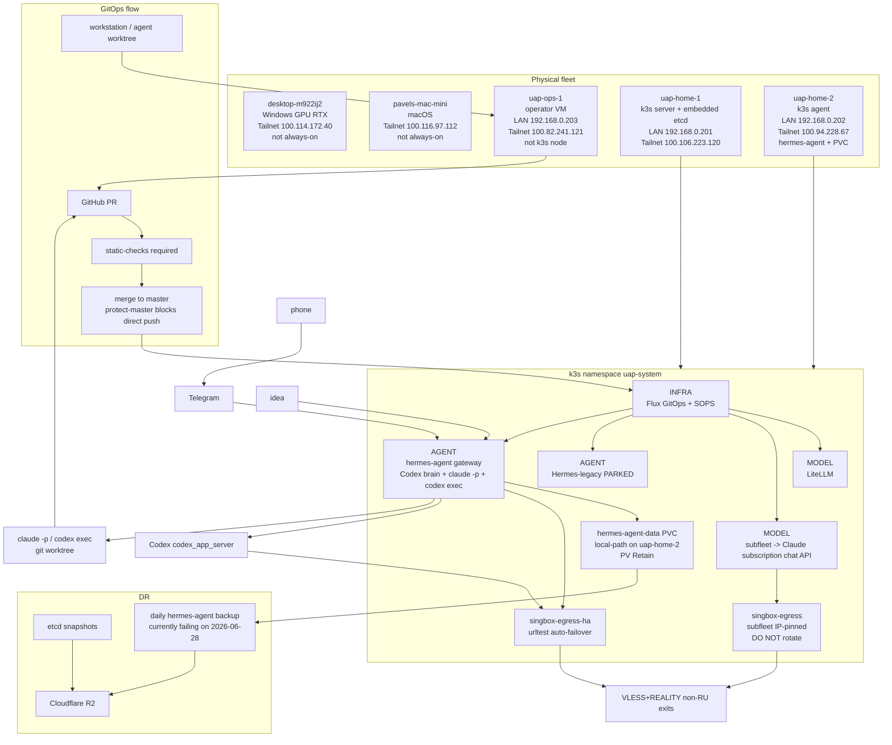

# UAP Readonly Infrastructure Audit - 2026-06-28

Audience: owner, Claude Code, Codex.

Mode:

- Audit was read-only, except this report file created after the owner requested a file.
- No source code, manifests, scripts, runbooks, Kubernetes objects, git branches, PRs, or remotes were changed by this audit.
- No `kubectl apply/delete/rollout/restart`, merge, push, restore drill, failover drill, or destructive operation was performed.
- Secret values are intentionally not copied here. If any token/key appeared in tool output, treat it as sensitive.

## Scope

Sources read first:

- `STATUS.md`
- `CLAUDE.md`
- `docs/infrastructure.md`
- `docs/next-steps.md`
- `runbooks/validation-matrix.md`
- `runbooks/hermes-agent-dr.md`
- `BUG-HUNT-CODEX-2026-06-28.md`

Additional live/read-only checks:

- GitHub PR state for PR #27-#37 via `gh`.
- Static local checks: `secret_scan.py`, `validate_iac.py`, `tests/static/test_*.py`.
- Live cluster via `uap-ops-1` with `KUBECONFIG=/home/uap/.kube/config`.
- Safe `kubectl exec` only for versions / non-secret health checks.

Important context:

- Local `HEAD` was still at old PR #25, but the working tree already contained post-hardening changes as unstaged/untracked files.
- GitHub showed PR #27-#34 merged, PR #35/#36 open, and PR #37 merged.
- PR #35 and PR #36 are pod-rolling changes and remain owner-gated.

## Verification Findings

| Item | Status | Evidence |
|---|---:|---|
| 1. Secret/IaC gate #27 | PASS | `python tests/static/secret_scan.py .` returned `secret-scan-ok`; `python tests/static/validate_iac.py .` returned `kustomization-orphans-ok` and `iac-static-ok`; `tests/static/test_sops_encrypted.py` passed 5/5; `tests/static/test_validate_iac_orphans.py` passed 6/6. CI runs `tests/static/test_*.py` in `.github/workflows/ci.yml`. Provider token patterns are present in `tests/static/secret_scan.py`; SOPS `ENC[...]` structural check is in `tests/static/validate_iac.py`. |
| 2. Backup #28 | FAIL operational | Manifest has `runAsUser: 0`, avoids `tee` pipe masking, and has hard/soft manifest validation. However the live CronJob `hermes-agent-backup` failed on 2026-06-28: Job `hermes-agent-backup-29710260` had 0/1 completions and 3 failed pods. Logs ended with `FATAL: hermes backup hit permission errors`. Last successful backup remained `2026-06-27T03:01:54Z`. |
| 3. Docs #29 | PASS with caveat | `STATUS.md`, `docs/next-steps.md`, `docs/infrastructure.md`, and `runbooks/validation-matrix.md` agree: quality gate enforced, B0/A4/A5 done, not HA, destructive drills owner-gated, and no human review by design. Caveat: `CLAUDE.md` still has an older bug-hunt pointer block near the top, but the current state section below it is updated. |
| 4. hermes-legacy #34 | PASS | `hermes/README.md` marks Hermes-legacy as `PARKED - superseded`; four known issues are accepted as parked-risk and intentionally not fixed unless un-parked. |
| 5. PR #35 hermes-agent pins/hardening | PASS, open, not live | PR #35 is `OPEN`, `MERGEABLE`, and `static-checks` passed. Manifest pins hermes-agent digest, Codex `0.142.0`, Claude Code `2.1.193`, adds no-RBAC ServiceAccount, `automountServiceAccountToken:false`, `seccompProfile: RuntimeDefault`, and TCP probes on 9119. Roll risk appears low because live endpoint `hermes-agent-dashboard` exposes `10.42.1.97:9119`. Not live yet: live Deployment still uses `nousresearch/hermes-agent:latest`, `config-rev v7-claude-worker`, and has no SA/probes hardening. |
| 6. PR #36 singbox hardening | PASS, open, not live | PR #36 is `OPEN`, `MERGEABLE`, and `static-checks` passed. Manifest adds no-RBAC ServiceAccount, `automountServiceAccountToken:false`, `seccompProfile: RuntimeDefault`, `allowPrivilegeEscalation:false`, `capabilities.drop: [ALL]`, and TCP probes on 12080. `sing-box check -c /etc/sing-box/config.json` passed live. Not live yet: live Deployment has no SA/probe/cap hardening. |
| 7. verify-local #31 | PASS | `tests/verify-local.ps1` has top-level `-Require` and passes it to git/S3/ops/PV checks. `powershell -ExecutionPolicy Bypass -File .\tests\verify-local.ps1 -SkipSmoke -SkipStatic -IncludeOps -Require` ended with `verify-local-ok`. Minor caveat: `check-ops-deploy-path.ps1` still printed a BOM-like `set: command not found`, but the deploy-path check itself completed. |
| 8. bootstrap #32 | PASS | `infra/ops/configure-github-flux.sh` defaults `UAP_GITHUB_VISIBILITY` to `public`; existing repos skip direct master push; branch+PR path exists for `UAP_COMMIT_AND_PUSH=1`; break-glass direct push is explicit via `UAP_ALLOW_DIRECT_MASTER_PUSH=1`. |
| 9. validate_iac orphan #30 | PASS | Orphan logic resolves resources relative to each kustomization directory, not by basename. `tests/static/test_validate_iac_orphans.py` passed 6/6, including cross-dir and duplicate-basename cases. |
| 10. PV Retain #33 | PASS | `tests/ops/check-pv-reclaim.ps1` exists. Live: PVC `hermes-agent-data` binds PV `pvc-f8007a41-83a4-49a5-976b-c861b42dd247`, reclaim policy `Retain`, status `Bound`, storage class `local-path`. Script with `-Require` returned `pv-reclaim-ok`. |

## Live Cluster Snapshot

Nodes:

| Node | Role | Version | Internal IP | Runtime |
|---|---|---|---|---|
| `uap-home-1` | control-plane, etcd | `v1.35.5+k3s1` | `100.106.223.120` | `containerd://2.2.3-k3s1` |
| `uap-home-2` | agent | `v1.35.5+k3s1` | `100.94.228.67` | `containerd://2.2.3-k3s1` |

Key `uap-system` workloads:

| Workload | Live status |
|---|---|
| `hermes` | `1/1 Running`, on `uap-home-2` |
| `hermes-agent` | `1/1 Running`, on `uap-home-2` |
| `litellm` | `1/1 Running`, on `uap-home-1` |
| `singbox-egress` | `1/1 Running`, on `uap-home-1` |
| `singbox-egress-ha` | `1/1 Running`, on `uap-home-1` |
| `subfleet-claude2api-bridge` | `1/1 Running`, on `uap-home-2` |
| `subfleet-claude2api-token-claude` | `1/1 Running`, on `uap-home-2` |
| `hermes-agent-backup-29710260` | `Failed`, 3 failed pods on 2026-06-28 |

Services/endpoints:

| Service | Endpoint / port |
|---|---|
| `hermes` | NodePort `8900:30890`, endpoint `10.42.1.74:8900` |
| `hermes-agent-dashboard` | NodePort `9119:30911`, endpoint `10.42.1.97:9119` |
| `litellm` | ClusterIP `4000`, endpoint `10.42.0.36:4000` |
| `singbox-egress` | ClusterIP `12080`, endpoint `10.42.0.43:12080` |
| `singbox-egress-ha` | ClusterIP `12080`, endpoint `10.42.0.47:12080` |
| `subfleet-claude2api-bridge` | ClusterIP `18902`, endpoint `10.42.1.56:18902` |

Live runtime/version check:

| Component | Expected from PR #35 | Live observed |
|---|---|---|
| hermes-agent image runtime | v0.17.0 digest `sha256:39fc...` | live image tag still `:latest`, imageID digest is `sha256:39fc...`; `hermes --version` reports `Hermes Agent v0.17.0` |
| Codex CLI | `0.142.0` | package metadata reports `0.142.0` |
| Claude Code CLI | `2.1.193` | package metadata reports `2.1.193` |
| sing-box | `v1.13.13` | `sing-box version 1.13.13` |

Conclusion:

- Runtime bits already match the intended PR #35 versions on the warm PVC/current pulled image.
- Deployment specs still need PR #35/#36 merge and pod roll to make pins, probes, ServiceAccounts, seccomp, and cap drops live.
- Backup is the main failing operational item right now.

## Owner Actions / Next Decisions

1. Investigate/fix `hermes-agent-backup` failing on permission-denied warnings. Current state means no fresh successful backup after 2026-06-27.
2. Owner merge PR #35 to roll `hermes-agent` onto pinned/hardened Deployment spec.
3. Owner merge PR #36 to roll `singbox-egress-ha` onto hardened Deployment spec.
4. After #35/#36 roll, rerun:
   - `kubectl -n uap-system get deploy hermes-agent singbox-egress-ha -o wide`
   - version smoke from `runbooks/hermes-agent-dr.md`
   - `powershell -ExecutionPolicy Bypass -File .\tests\ops\check-pv-reclaim.ps1 -Require`
5. Keep HA claims blocked until a third independent k3s server and owner-approved failover drill are complete.

## Mermaid Diagram



## ASCII Diagram

```text
Tailnet mesh:

  desktop GPU        mac-mini
       \              /
        \            /
       uap-ops-1  [operator, not k3s]
            |
            | kubectl + git branch/PR
            v
  uap-home-1 ---------------- uap-home-2
  k3s server + etcd           k3s agent + hermes-agent PVC

GitOps:

  workstation/agent
        |
        v
  uap-ops-1 -> GitHub PR -> static-checks -> merge to master -> Flux -> k3s

uap-system:

  INFRA:
    Flux + SOPS

  MODEL:
    subfleet -> singbox-egress IP-pinned -> Claude subscription
    LiteLLM  -> subfleet

  AGENT:
    hermes-agent -> Codex brain
    hermes-agent -> claude -p / codex exec in git worktrees
    Hermes-legacy PARKED

Egress:

  subfleet     -> singbox-egress    -> fixed VLESS exit
  hermes-agent -> singbox-egress-ha -> urltest VLESS exits

DR:

  etcd snapshots -> R2
  hermes-agent-data PVC on uap-home-2, PV Retain -> daily backup -> R2
  Current issue: 2026-06-28 hermes-agent backup job failed on permission denied.
```

## Legend

- LAN `192.168.*`: local Proxmox / local access plane.
- Tailnet `100.*`: primary safe mesh transport between devices and VMs.
- `uap-ops-1`: operator VM. It has git/kubectl/deploy tooling but is not a k3s node.
- `uap-home-1`: only k3s server and embedded etcd member today. This is why the cluster is not HA.
- `uap-home-2`: k3s worker node where `hermes-agent` and its node-local PVC live.
- `singbox-egress`: fixed/IP-pinned egress for subfleet. Do not rotate it behind urltest.
- `singbox-egress-ha`: rotating/urltest egress for hermes-agent, Codex brain, and Telegram.
- `Hermes-legacy`: kept as Flux-reconciled fallback, but parked and not maintained.

